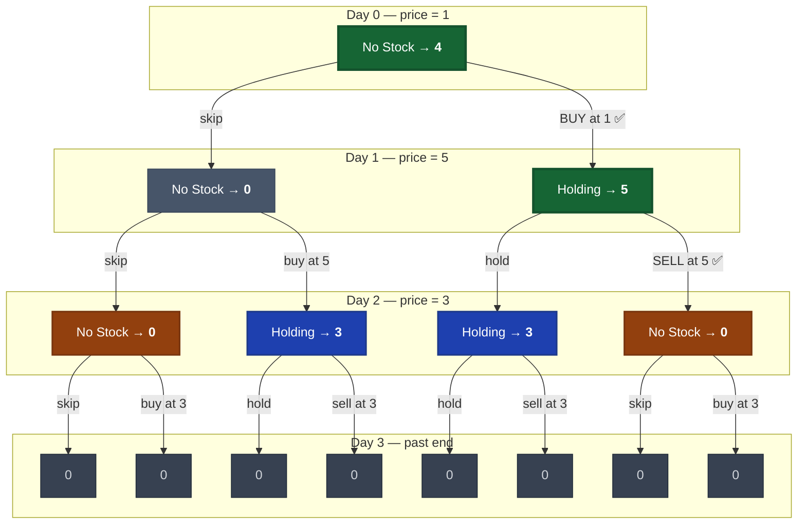

# Best Time to Buy and Sell Stock

[LeetCode 121](https://leetcode.com/problems/best-time-to-buy-and-sell-stock/)

## Recursive Formulation

State: `(day, holding)` where `holding` is 0 (no stock) or 1 (holding stock).

```
solve(i, 0) = max(solve(i+1, 0),  -prices[i] + solve(i+1, 1))   # skip or buy
solve(i, 1) = max(solve(i+1, 1),   prices[i] + solve(i+1, 0))   # skip or sell
base: i == n  ->  0
```

## Recursion Tree

Example: `prices = [1, 5, 3]`



**How to read:**
- Each node shows `state → best profit from here`
- Edges = decisions (skip/buy/sell) at that day's price
- **Green** = optimal path: buy at 1, sell at 5 = **profit 4**
- **Amber** = overlapping `(day 2, no stock)` — computed twice, same result
- **Blue** = overlapping `(day 2, holding)` — computed twice, same result
- **Grey** = base cases (no more days)

## Overlapping Subproblems

The tree exposes repeated computation -- the core motivation for DP:

| State | Computed at | Result |
|-------|------------|--------|
| `solve(2, 0)` | nodes C, F | 0 |
| `solve(2, 1)` | nodes D, E | 3 |
| `solve(3, 0)` | nodes G, J, L, M | 0 |
| `solve(3, 1)` | nodes H, I, K, N | 0 |

Without memoization: **O(2^n)** nodes. With memoization: **O(n)** unique states (2 per day).

## Solution

```python
def maxProfit(prices: list[int]) -> int:
    n = len(prices)
    memo = {}

    def solve(i, holding):
        if i == n:
            return 0
        if (i, holding) in memo:
            return memo[(i, holding)]

        skip = solve(i + 1, holding)
        if holding:
            act = prices[i] + solve(i + 1, 0)  # sell
        else:
            act = -prices[i] + solve(i + 1, 1)  # buy

        memo[(i, holding)] = max(skip, act)
        return memo[(i, holding)]

    return solve(0, 0)
```

Optimized to O(1) space -- only need two variables:

```python
def maxProfit(prices: list[int]) -> int:
    min_price = float('inf')
    max_profit = 0
    for price in prices:
        min_price = min(min_price, price)
        max_profit = max(max_profit, price - min_price)
    return max_profit
```
