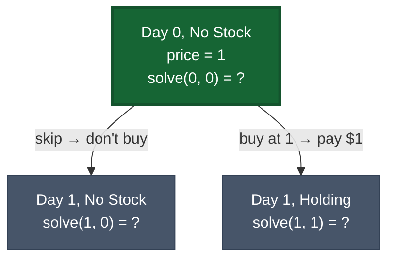
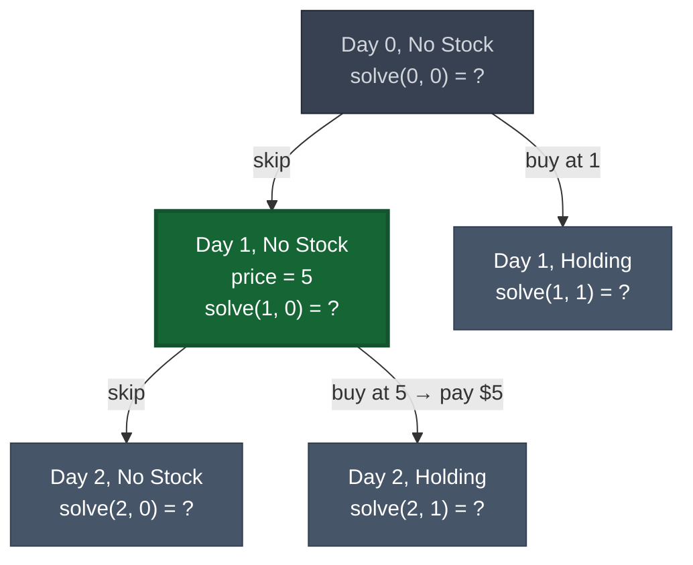
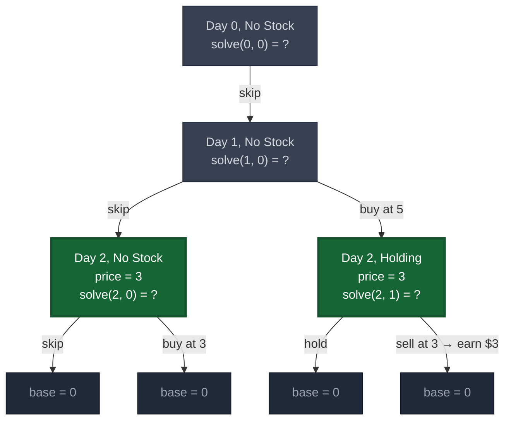
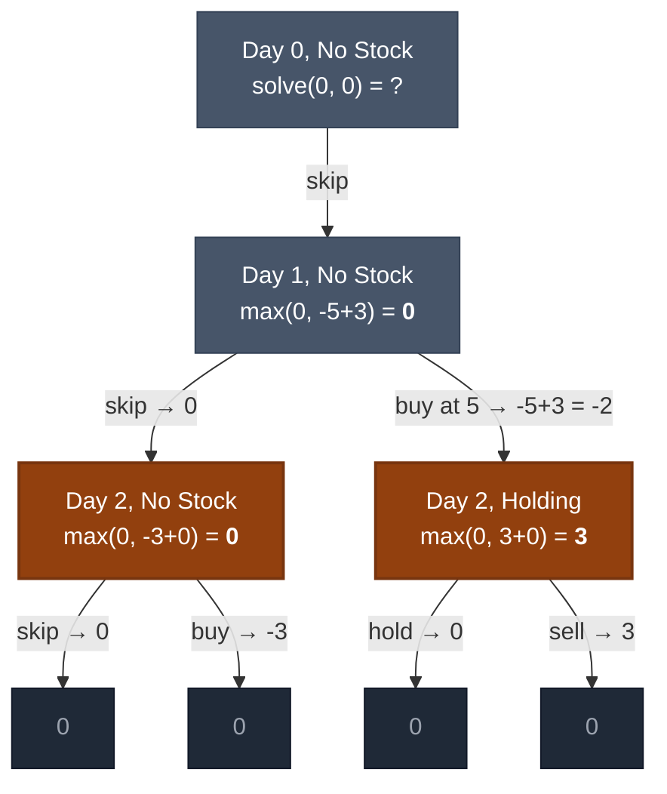
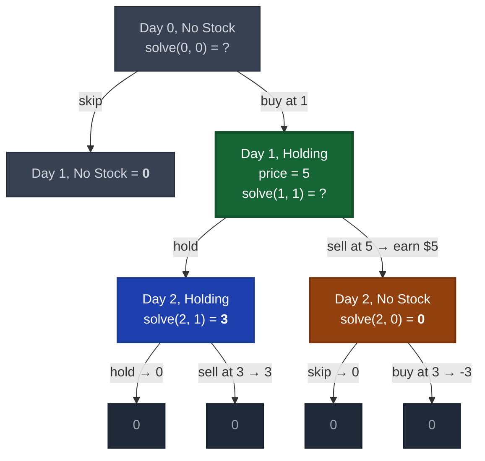
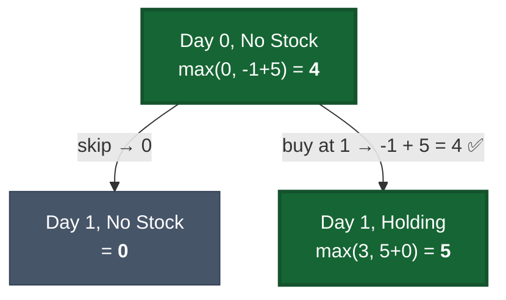

# Best Time to Buy and Sell Stock

[LeetCode 121](https://leetcode.com/problems/best-time-to-buy-and-sell-stock/)

## Recursive Formulation

State: `(day, holding)` where `holding` is 0 (no stock) or 1 (holding stock).

```
solve(i, 0) = max(solve(i+1, 0),  -prices[i] + solve(i+1, 1))   # skip or buy
solve(i, 1) = max(solve(i+1, 1),   prices[i] + solve(i+1, 0))   # skip or sell
base: i == n  ->  0
```

## Recursion Tree (Step by Step)

Example: `prices = [1, 5, 3]`. We call `solve(0, 0)` — starting at day 0, not holding stock.

### Step 1: The First Choice

At day 0 (price=1), we don't hold stock. Two options: skip this day, or buy.



To know which choice is better, we must solve both children first.

### Step 2: Explore the Skip Branch

We skipped day 0. Now at day 1 (price=5), still no stock. Again: skip or buy.



### Step 3: Reach Base Cases (Left Subtree)

Keep going deeper. Day 2 (price=3) branches hit day 3 = past the end = base case returns 0.



### Step 4: Values Bubble Up (Left Subtree)

Base cases return 0. Now we can compute day 2 values, then day 1.



> `solve(1, 0) = max(skip=0, buy=-5+3=-2) = 0`. Buying at 5 is a bad deal.

### Step 5: Explore the Buy Branch

Now we solve the right branch: we bought at day 0. At day 1 (price=5), holding stock. Options: hold or sell.



> **Overlapping subproblems!** `solve(2, 0)` and `solve(2, 1)` were already computed in Step 4. With memoization, we just look them up.

### Step 6: Final Answer

All values known. Bubble up to root.



> `solve(0, 0) = max(skip=0, buy=-1+5=4) = 4`
>
> **Optimal strategy: buy at price 1, sell at price 5, profit = 4**

### Why DP?

The overlapping subproblems exposed above are the key insight:

| State | Appears in | Result |
|-------|-----------|--------|
| `solve(2, 0)` | Step 4 and Step 5 | 0 |
| `solve(2, 1)` | Step 4 and Step 5 | 3 |

Without memoization the tree has **O(2^n)** nodes. With memoization only **O(n)** unique states (2 per day).

## Solution

```python
def maxProfit(prices: list[int]) -> int:
    n = len(prices)
    memo = {}

    def solve(i, holding):
        if i == n:
            return 0
        if (i, holding) in memo:
            return memo[(i, holding)]

        skip = solve(i + 1, holding)
        if holding:
            act = prices[i] + solve(i + 1, 0)  # sell
        else:
            act = -prices[i] + solve(i + 1, 1)  # buy

        memo[(i, holding)] = max(skip, act)
        return memo[(i, holding)]

    return solve(0, 0)
```

Optimized to O(1) space -- only need two variables:

```python
def maxProfit(prices: list[int]) -> int:
    min_price = float('inf')
    max_profit = 0
    for price in prices:
        min_price = min(min_price, price)
        max_profit = max(max_profit, price - min_price)
    return max_profit
```
