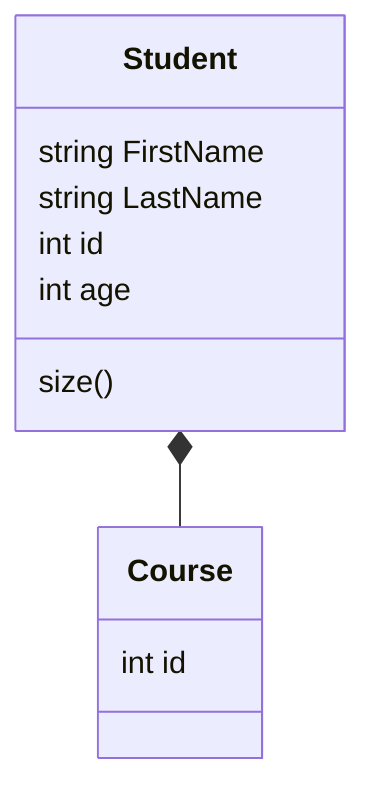

# Abstraction

Abstraction is basically capturing the core data of an object and ignoring the details

```mermaid
classDiagram
Student *-- Course
Course : int id
Student : size()
Student : string FirstName
Student : string LastName
Student: int id
Student: int age
```