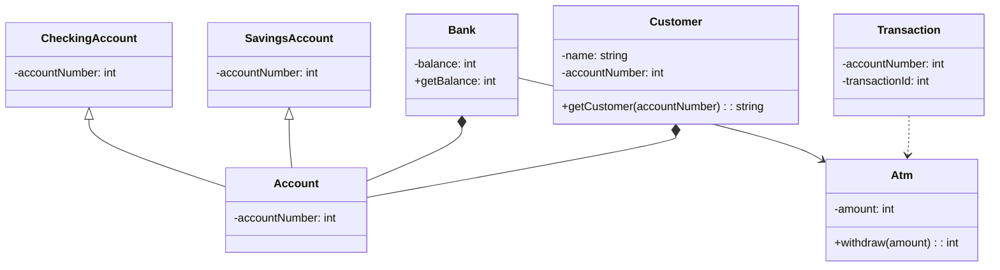

# Banl UML

UML Diagram

```mermaid


classDiagram

class Bank {
-balance: int
+getBalance: int
}

class Atm {
-amount: int
+withdraw(amount): int
}

class Customer {
-name: string
-accountNumber: int
+getCustomer(accountNumber): string
}

class Account {
-accountNumber: int
}

class Transaction {
-accountNumber: int
-transactionId: int
}

class CheckingAccount {
-accountNumber: int
}

class SavingsAccount {
-accountNumber: int
}

CheckingAccount <|-- Account
SavingsAccount <|-- Account
Bank *-- Account
Customer *-- Account
Bank --> Atm
Transaction ..> Atm
```